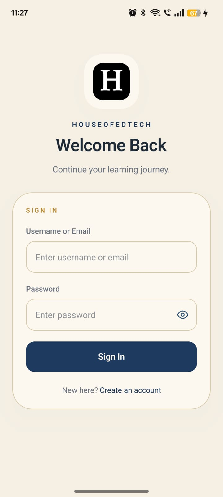
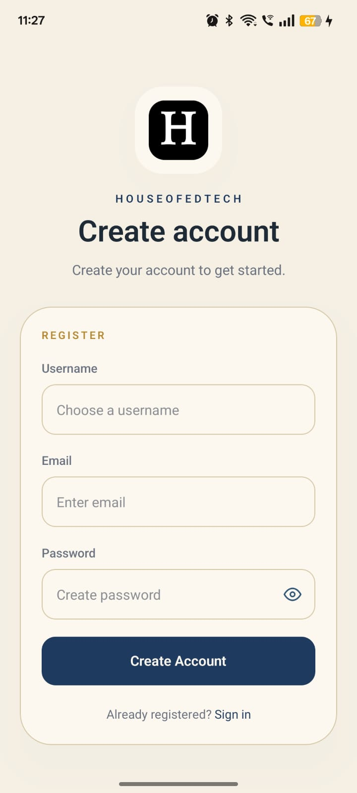
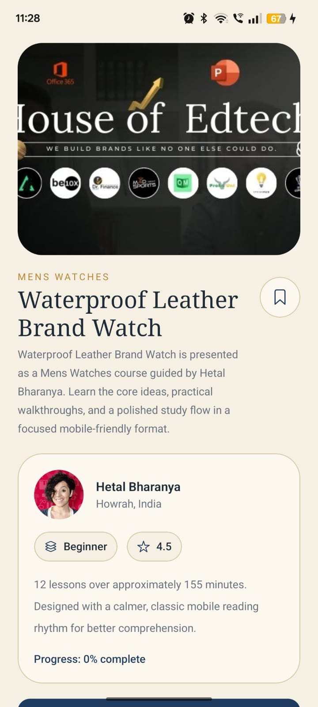

# HouseofEdTech Mini LMS

## Project URL

Repository: `Add your GitHub repository URL here`

## Screenshots

<table>
  <tr>
    <td align="center"><b>Splash Screen</b></td>
    <td align="center"><b>Login</b></td>
    <td align="center"><b>Register</b></td>
  </tr>
  <tr>
    <td></td>
    <td></td>
    <td></td>
  </tr>
  <tr>
    <td align="center"><b>Catalog</b></td>
    <td align="center"><b>Search In Catalog</b></td>
    <td align="center"><b>Course Details</b></td>
  </tr>
  <tr>
    <td></td>
    <td></td>
    <td></td>
  </tr>
  <tr>
    <td align="center"><b>Enrollment Success</b></td>
    <td align="center"><b>Embedded Viewer</b></td>
    <td align="center"><b>Bookmarks</b></td>
  </tr>
  <tr>
    <td></td>
    <td></td>
    <td></td>
  </tr>
  <tr>
    <td align="center"><b>Enrolled Courses</b></td>
    <td align="center"><b>Profile</b></td>
    <td align="center"><b>Edit Profile</b></td>
  </tr>
  <tr>
    <td></td>
    <td></td>
    <td></td>
  </tr>
  <tr>
    <td align="center"><b>Profile Photo Sheet</b></td>
    <td align="center"><b>Edit Photo Sheet</b></td>
    <td align="center"><b>Loading Screen</b></td>
  </tr>
  <tr>
    <td></td>
    <td></td>
    <td></td>
  </tr>
  <tr>
    <td align="center"><b>Offline Banner</b></td>
    <td align="center"><b>Bookmark Notification</b></td>
    <td align="center"><b>Not Found</b></td>
  </tr>
  <tr>
    <td></td>
    <td></td>
    <td></td>
  </tr>
</table>

Place all screenshots inside: `assets/images/`

HouseofEdTech is a React Native Expo assignment project built as a mini learning management system (LMS).  
The app focuses on a calm, classic course-browsing experience instead of a generic template UI, while still keeping the codebase structured like a production-ready mobile app.

This README is written for:

- assignment reviewers
- developers who want to run the project locally
- users who want to understand what the app does

## Project Summary

This application allows a learner to:

- create an account or sign in
- browse a course catalog
- search courses
- bookmark courses
- enroll in courses
- open course content in an embedded viewer
- manage profile details
- use the app with persisted local state

The app uses a mock-first service layer so the project stays stable during review, while still being ready for real API integration later.

## What The User Can Do

- Sign in and register
- Restore session after app relaunch
- Browse the full course catalog
- Search by title, description, instructor, or category
- Bookmark and unbookmark courses
- View saved/bookmarked courses
- Enroll in a course
- See enrollment success feedback in a custom modal
- Open the embedded learning viewer
- View enrolled courses
- View profile stats
- Edit name, email, and avatar
- Pick profile image from camera or gallery
- Use the app with local persistence for bookmarks, enrollments, and preferences
- Receive local reminder and bookmark milestone notifications

## What I Developed

This assignment was developed with focus on:

- clean route-based navigation using Expo Router
- Zustand state management for auth, courses, and preferences
- reusable UI components for buttons, inputs, screens, and cards
- clear separation between services, stores, UI, and domain models
- mobile-friendly UI/UX improvements across catalog, profile, bookmarks, and course details
- local persistence using SecureStore and AsyncStorage
- mock-first API architecture that can be switched to a real backend later

## Key Features

- Authentication flow with login and registration
- Session bootstrap and redirect handling
- Course catalog with performant list rendering
- Bookmarking with immediate UI update
- Enrollment flow with success modal
- Bookmarked courses screen
- Enrolled courses screen
- Profile screen with learner stats
- Profile edit screen with avatar update
- Embedded course viewer
- Offline banner support
- Notification support for learning reminders and bookmark milestones

## Screen Inventory

The project includes the following user-facing screens and important views.  
For assignment review, this project contains 15+ user-facing screens/views including route screens, success sheets, and action sheets.

### Main route screens

1. Root redirect screen
2. Login screen
3. Register screen
4. Catalog tab
5. Bookmarks tab
6. Profile tab
7. Course detail screen
8. Enrolled courses screen
9. Embedded viewer screen
10. Edit profile screen
11. Not found fallback screen

### Important app views and modal screens

12. Enrollment success modal
13. Profile photo action sheet on Profile screen
14. Profile photo action sheet on Edit Profile screen
15. Global loading screen during app bootstrap

## Tech Stack

- Expo SDK 54
- React Native
- Expo Router
- TypeScript
- NativeWind
- Zustand
- Expo SecureStore
- AsyncStorage
- Expo Notifications
- Expo Image
- Expo Image Picker
- Expo File System
- React Native WebView
- NetInfo
- Legend List

## Setup Instructions

### 1. Clone the project

```bash
git clone <your-repository-url>
cd HouseofEdTech
```

### 2. Install dependencies

```bash
npm install
```

### 3. Start the Expo development server

```bash
npm run start
```

### 4. Run on a device or emulator

```bash
npm run android
```

or

```bash
npm run ios
```

If you only want the Expo dev server:

```bash
npx expo start
```

## Useful Commands

```bash
npm run start
npm run android
npm run ios
npm run lint
npm run typecheck
```

## Runtime Configuration

This assignment currently does not require a separate `.env` file.

Runtime config values are defined in `app.json` under:

- `expo.extra.apiBaseUrl`
- `expo.extra.useMockApi`

## Mock Mode And Real API Mode

The app is intentionally configured in mock mode by default so the assignment is stable and easy to review.

If you want to connect a real API later:

1. Open `app.json`
2. Change `expo.extra.useMockApi` from `true` to `false`
3. Keep `expo.extra.apiBaseUrl` pointed to your API base URL
4. Expand request mapping inside:
   `src/services/api/auth-service.ts`
5. Expand request mapping inside:
   `src/services/api/course-service.ts`

## Project Structure

```text
HouseofEdTech/
├─ app/
│  ├─ _layout.tsx
│  ├─ index.tsx
│  ├─ +not-found.tsx
│  ├─ (auth)/
│  │  ├─ _layout.tsx
│  │  ├─ login.tsx
│  │  └─ register.tsx
│  └─ (app)/
│     ├─ _layout.tsx
│     ├─ (tabs)/
│     │  ├─ _layout.tsx
│     │  ├─ index.tsx
│     │  ├─ bookmarks.tsx
│     │  └─ profile.tsx
│     ├─ course/
│     │  └─ [id].tsx
│     ├─ courses/
│     │  └─ enrolled.tsx
│     ├─ profile/
│     │  └─ edit.tsx
│     └─ viewer/
│        └─ [id].tsx
├─ src/
│  ├─ components/
│  │  ├─ course-card.tsx
│  │  ├─ offline-banner.tsx
│  │  └─ ui/
│  ├─ config/
│  ├─ lib/
│  ├─ providers/
│  ├─ services/
│  │  ├─ api/
│  │  ├─ notifications.ts
│  │  └─ webview-template.ts
│  ├─ stores/
│  └─ types/
├─ app.json
├─ global.css
├─ package.json
└─ README.md
```

## Architecture Notes

### `app/`

Contains all route-based screens using Expo Router.

### `src/components/`

Reusable feature and UI components such as:

- course cards
- buttons
- inputs
- screen wrapper
- section headers
- loading and offline UI

### `src/stores/`

Zustand stores for:

- authentication
- course state
- user preferences

### `src/services/`

Contains:

- API service layer
- notification helpers
- embedded viewer template logic

### `src/lib/`

Shared storage helpers for SecureStore and AsyncStorage.

### `src/types/`

Domain model types used across the app.

## Storage Strategy

- auth/session tokens are stored with Expo SecureStore
- bookmarks, preferences, enrollments, and progress are stored with AsyncStorage

This keeps sensitive auth data separated from regular app state.

## UI/UX Notes

The UI follows a calm learning-product direction:

- paper-style background and softer visual palette
- rounded course cards and modal sheets
- compact bottom navigation
- reduced visual noise in scrolling lists
- cleaner bookmark and enrollment interactions

Recent UI improvements include:

- smoother bookmark interaction
- cleaner bottom navigation spacing
- hidden vertical scroll indicators for cleaner presentation
- improved enroll success feedback with a custom modal

## Assignment Review Flow

If you are reviewing this project, a good demo flow is:

1. Open the app
2. Register or log in
3. Browse the course catalog
4. Search for a course
5. Bookmark a course
6. Open course details
7. Enroll in the course
8. See the enrollment success modal
9. Open the embedded viewer
10. Visit Bookmarks, Enrolled Courses, and Profile screens
11. Edit profile details and avatar

## Known Limitations

- The project is mock-first by default and not fully wired to a production backend
- No automated test suite is included yet
- Notifications are local-device based
- Some APIs are prepared for extension rather than fully production-connected

## Why This README Is Written This Way

This file is intentionally written for assignment submission clarity:

- easy setup for reviewers
- clear feature summary
- understandable project structure
- visible screen inventory
- explanation of user flow and developer decisions

## Author Note

This project was prepared as a developer assignment submission with attention to both:

- user experience
- maintainable engineering structure

The goal was not only to make the app work, but also to make the code understandable for future development.
